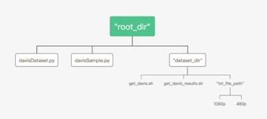
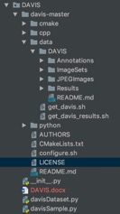
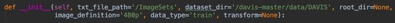

# 文件结构

    

    你可以直接克隆我们的工程，然后运行get_davis.sh，当然你也可以自行下载数据包然后构造文件结构。
    davis2016大概有1.8GB。
    下面是文件结构的例子：

# Class DavisDataset

    这个类继承于torch.utils.data.dataset.Dataset，用于数据集读入的初始化。

## 构造方法__init__参数详解：

### txt_file_path
    指出存放数据文件位置的文件的文件夹
### dataset_dir
    指出存放数据的文件夹
### root_dir
    如果不特别指定，该类将会自动填充项目文件所在位置的绝对路径，如果在其他项目调用该类，请务必手动填充davisDataset.py文件所在位置，或者将项目文件和该类置于同一目录。
### image_definition
    你的选择范围为{‘480p’,’1080p’}，分别代表不同像素的图片（输入数据）。
### data_type
    你的选择范围为{‘train’, ‘val’, ‘test’}，分别代表不同类型的数据集
### transform
    transform可以为自定义函数，用于diy数据格式，比如flatten(x)。

# DavisSample.py

    该类用于测试class DavisDataset是否正常工作，当然你可以自己实现。

    Sudo pip install -r requirements.txt
    Cd DAVIS
    Python DavisSample.py
